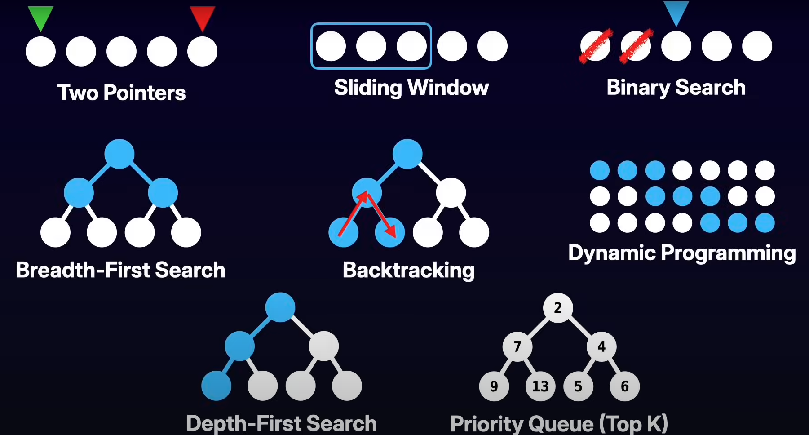

# Go Code (by Emixam23)

> 🚀 A LeetCode practice repo in **Go**, organized by patterns and difficulty levels.  
> Goal: Quickly recognize recurring problem-solving patterns and apply the right solution efficiently.

---

## 📂 Repo Structure

```
Go Code/
│
├── docs/
│   └── 8-patterns.png   # Visual summary of the 8 key patterns
│
├── practice/
│   ├── easy/
│   │   └── two-sum/
│   │       ├── exe.go        # function to implement
│   │       ├── exe_test.go   # unit tests
│   │       └── README.md     # problem description
│   ├── medium/
│   └── hard/
```

Each exercise has its own folder with:
- **exe.go** → the function to implement  
- **exe_test.go** → test cases to validate the solution  
- **README.md** → problem description  

---

## 🎯 The 8 Key Patterns


*credits: [LeetCode Was Hard Until I Learned THESE 8 Patterns (With Templates!)](https://www.youtube.com/watch?v=RYT08CaYq6A&ab_channel=AlgoMonster)*

### 1. Two Pointers
**Idea:** Use two pointers (start/end or fast/slow) to traverse a structure more efficiently.  

**When to use:**
- Sorted arrays → find a target sum (e.g., Two Sum II)  
- Detect palindromes  
- Array compression / merging intervals  

⏱️ Typical complexity: `O(n)` time, `O(1)` space  

---

### 2. Sliding Window
**Idea:** Maintain a dynamic window (start/end indices) to track subarrays or substrings that satisfy a condition.  

**When to use:**
- Longest substring without repeating characters  
- Subarray sum problems  
- Minimum/maximum window problems  

⏱️ Typical complexity: `O(n)` time, `O(1)`–`O(k)` space  

---

### 3. Binary Search
**Idea:** Divide and conquer on sorted input or monotonic property.  

**When to use:**
- Search in sorted arrays  
- First/last occurrence problems  
- Binary search on the answer (capacity, minimum threshold, etc.)  

⏱️ Typical complexity: `O(log n)` per search  

---

### 4. Breadth-First Search (BFS)
**Idea:** Explore level by level using a queue. Best for shortest paths in unweighted graphs.  

**When to use:**
- Shortest path in a grid or graph  
- Level order traversal in trees  
- Connected components detection  

⏱️ Typical complexity: `O(V + E)`  

---

### 5. Depth-First Search (DFS)
**Idea:** Explore deeply using recursion or a stack. Great for full exploration of states.  

**When to use:**
- Graph/tree traversal  
- Detecting cycles, connected components  
- Flood fill problems (e.g., Number of Islands)  

⏱️ Typical complexity: `O(V + E)`  

---

### 6. Dynamic Programming (DP)
**Idea:** Break problems into overlapping subproblems and build solutions using previously computed results.

**When to use:**
- Optimal substructure problems (min/max, count ways)
- Sequence problems (Longest Increasing Subsequence, LCS)
- Partitioning, knapsack-type problems
- Grid path counting, stock buy/sell

⏱️ Typical complexity:
- Time: `O(n)`, `O(n*m)`, or more depending on dimensions
- Space: often reducible from `O(n*m)` → `O(n)` with optimization

---

### 7. Backtracking
**Idea:** Explore all possible configurations by building solutions incrementally and undoing (backtracking) when invalid.  

**When to use:**
- Generating permutations, combinations, subsets  
- Solving puzzles (Sudoku, N-Queens)  
- Constraint satisfaction problems  

⏱️ Typical complexity: exponential, but pruned with constraints  

---

### 8. Priority Queue (Heap) / Top-K
**Idea:** Use a heap to maintain dynamic ordering of elements (min/max).  

**When to use:**
- Find the `k` largest/smallest elements  
- Stream processing (continuous data)  
- Scheduling problems (Dijkstra’s algorithm, CPU tasks)  

⏱️ Typical complexity: `O(n log k)`  

---

### 9. Hashing (HashMap / HashSet)
**Idea:** Use hash tables for constant-time lookups.  

**When to use:**
- Detect duplicates  
- Frequency counting  
- “Complement” problems (e.g., Two Sum)  
- Fast membership queries  

⏱️ Typical complexity: `O(1)` average-case operations  

---

## 📘 How to Use This Repo

1. Pick a **pattern** you want to practice.  
2. Open the corresponding **problem folder** under `practice/easy|medium|hard`.  
3. Implement your solution in `exe.go`.  
4. Run tests with:  
   ```bash
   go test ./practice/easy/two-sum
   ```
5. Compare against documented explanations and iterate.

---


